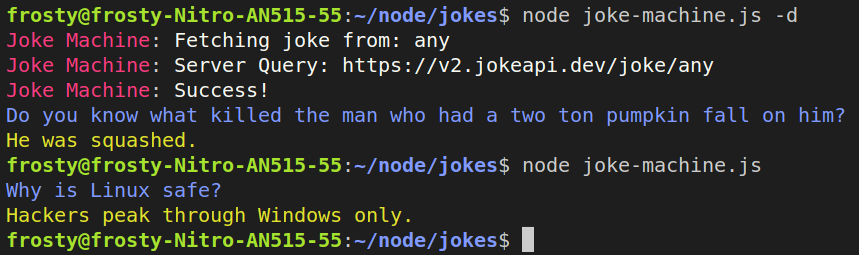

# Joke-Machine
Silly little node app that displays a joke.  
This uses the free api http://jokeapi.dev.  
Great to put as part of a shell logon script.

# Install
- Clone/Download the repository
- Run '**npm install**'

# Running
- node joke-machine
- npm start

# Help
- node joke-machine -h
